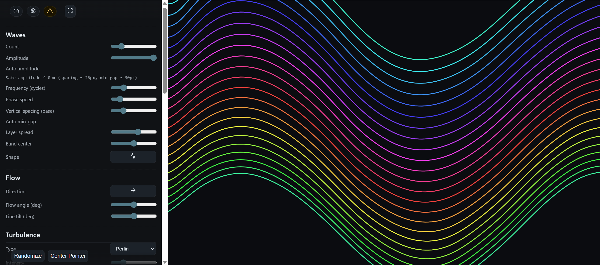

# Wave Playground (Next.js + TypeScript)



A modern Next.js + TypeScript port of the original Wave Playground, preserving the same interactive wave simulation and UI while updating the codebase for React App Router and strict typing.

## Highlights

- Fully ported from vanilla JavaScript to TypeScript
- Client-only canvas simulation with responsive controls
- Preset save/load/export/import using localStorage
- Adaptive performance heuristics and visual customization

## Quick Start

```powershell
npm install
npm run dev
```

Open: `http://localhost:3000`

## Build for Production

```powershell
npm run build
npm run start
```

## Project Structure

- `app/layout.tsx` – Root layout, metadata, and global wrapper
- `app/page.tsx` – Client page rendering the full canvas UI
- `app/globals.css` – Global styles
- `src/` – Main application logic
  - `core/` – simulation, drawing, input, utilities, state, presets
  - `main/` – app bootstrap, loop, hotkeys, canvas handling
  - `simulation/` – physics, interactions, wave/turbulence, layers
  - `ui/` – bindings, sync, visibility, presets, controls
- `public/` – static assets, including `screenshot.png`

## Notes

- The app uses a client component to ensure browser APIs only run in the browser.
- Original DOM-based logic is preserved where possible while moving to React/Next.js.

## License

MIT. See [LICENSE](LICENSE).
